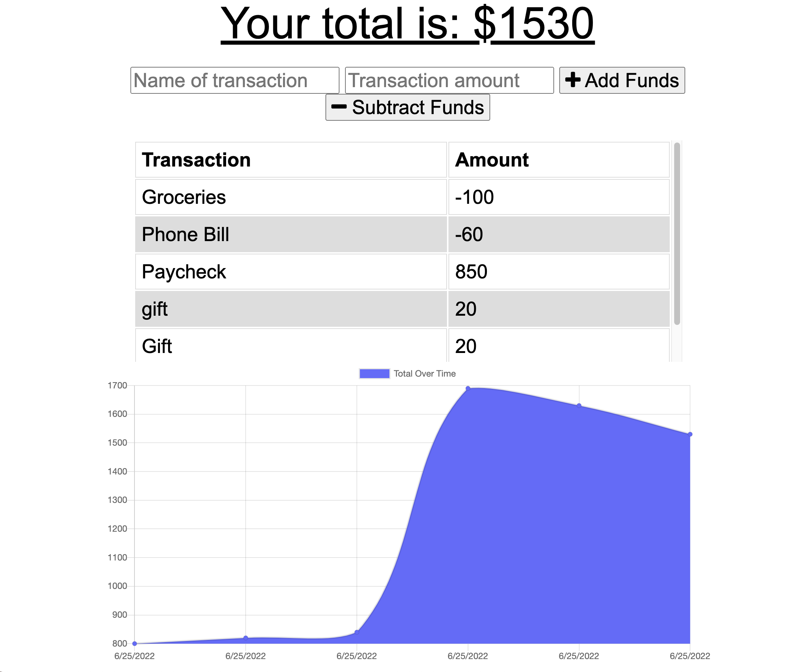

# Budget Tracker

- A simple app used to budget by adding and subtracting funds
- View spending trends with generated graph

## Features

- Uses MongoDB and Mongoose to store data for a Social Media App
- Mongoose is utlized to create CRUD operations for commonly used social media features such as adding a user, deleting a user, updating a user, adding thoughts, etc.
- Server built using Express.js
- Progressive Web Application using a Service Worker andIndexDB
## Installation

Tools used include:
- Node.js
- MongoDB
- Mongoose
- Express.js

Run the following command to install dependencies

```bash
  npm i

```

Run the following command to start the server
```bash
  npm start

```

Routes built and tested with Insomnia

Node.js Documentation
https://nodejs.org/en/docs/

MongoDB
https://www.mongodb.com/docs/

Mongoose Documentation
https://mongoosejs.com/docs/guide.html

Express.js Documentation
https://expressjs.com/

## Deployment

Deployed with Heroku at [insert heroku link here]

## Snapshots




## Authors

- [Brittany Ganser](https://github.com/bganser15)

